# Farmers Point V2


Farmers Point V2 is a comprehensive platform designed to assist farmers with advanced features such as crop scanning, community interaction, and transaction tracking. 
<div style="display: flex; justify-content: space-between;">
    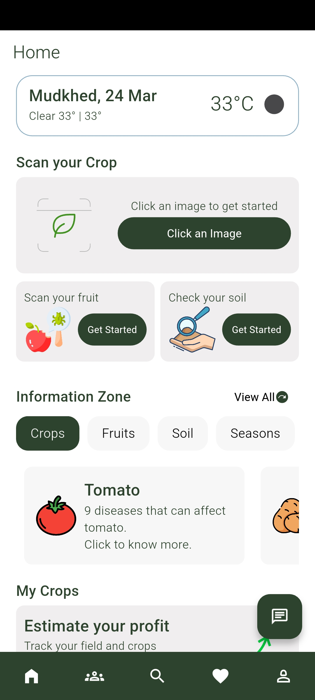
    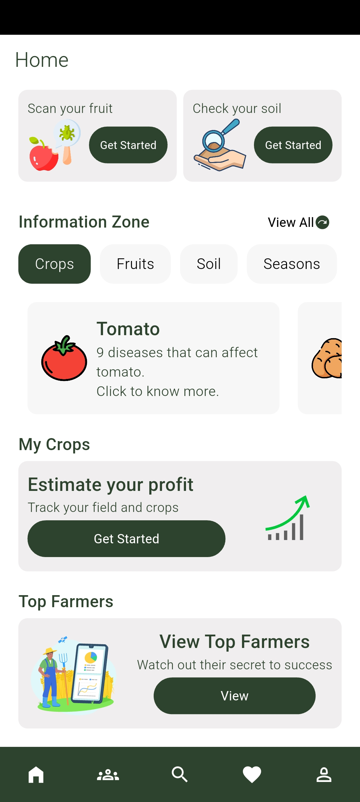
</div>


## Features

### 🌾 Scan Your Crop
Get AI-based insights by uploading an image of your crop to detect diseases, growth status, and more.

<div style="display: flex; justify-content: space-between;">
    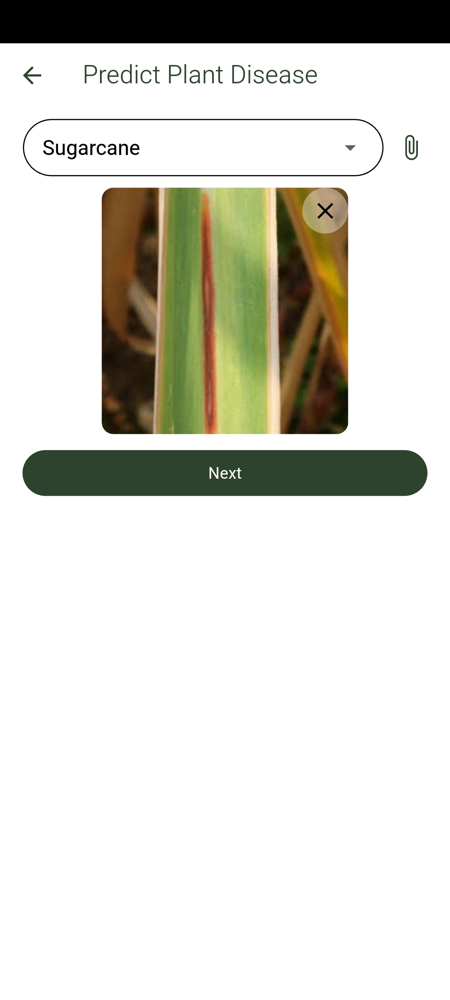
    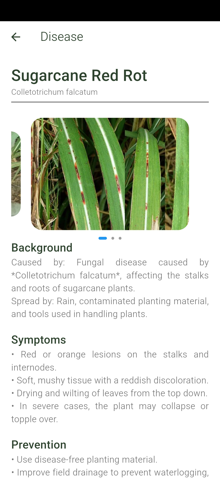
</div>

### 🍏 Scan Fruit
Identify fruits and get instant information on their health, ripeness, and market value using image recognition.

### ℹ️ Information Zone
Provides key insights on crops, fruits, soil, seasons, and diseases to help farmers make informed decisions.

<div style="display: flex; justify-content: space-between;">
    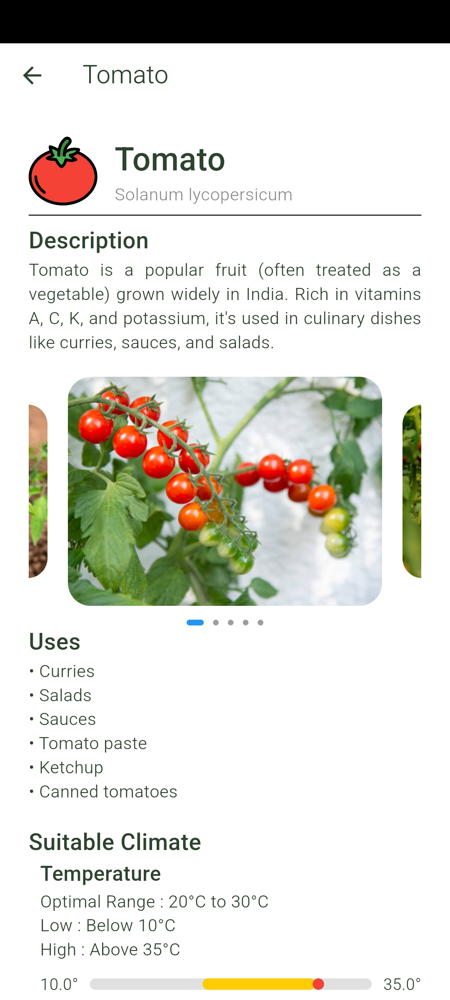
    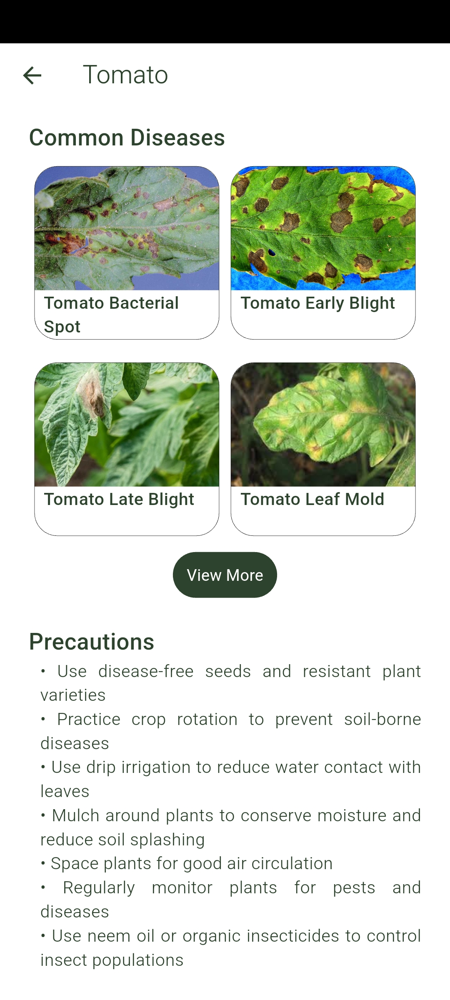
</div>

### 🗣 Community
A dedicated space where farmers can connect, discuss agricultural topics, share experiences, and seek advice from fellow farmers.
Engage with other farmers by creating posts and replying to their queries to share knowledge and experiences.

<div style="display: flex; justify-content: space-between;">
    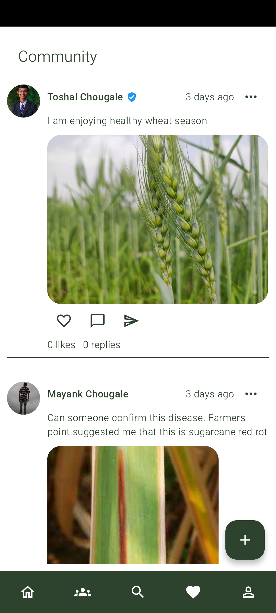
    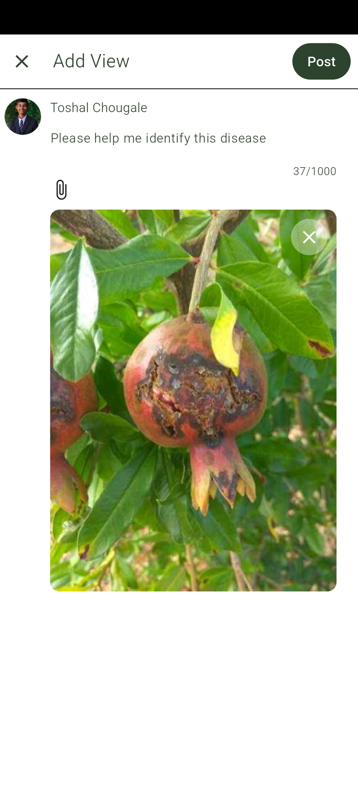
</div>


### 🤖 Chatbot
An AI-powered chatbot that provides instant support, answers frequently asked questions, and offers guidance on farming-related queries.


### 👤 Profile & Notifications
Farmers can manage their profiles, track their activities, and receive important notifications about their crops, posts, and transactions.

<div style="display: flex; justify-content: space-between;">
    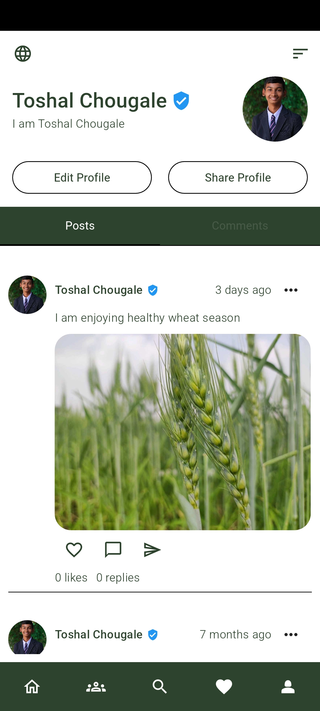
    
</div>


### 🌱 My Crops
Farmers can manage their crops, track their growth progress, and receive insights based on AI analysis.

<div style="display: flex; justify-content: space-between;">
    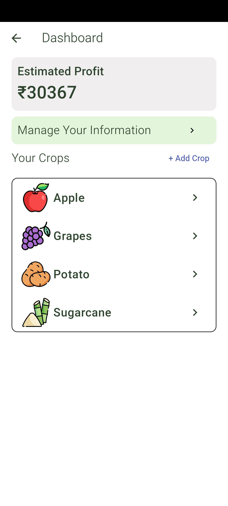
    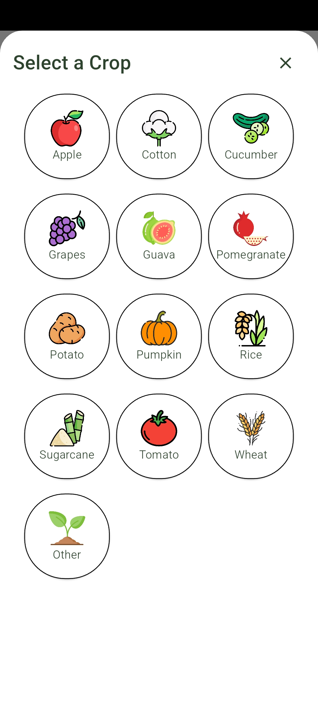
</div>


### 💰 Crop Transactions
Keep track of all crop sales, purchases, and transaction history within the app.

<div style="display: flex; justify-content: space-between;">
    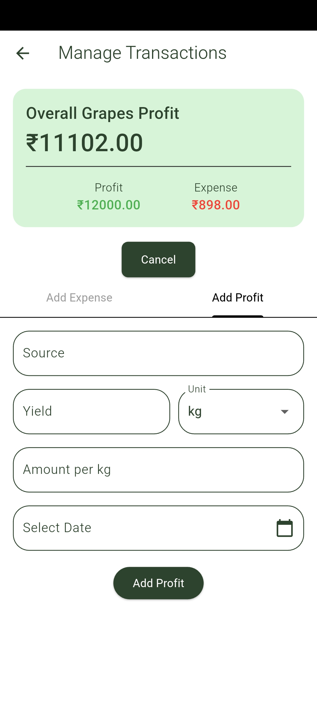
    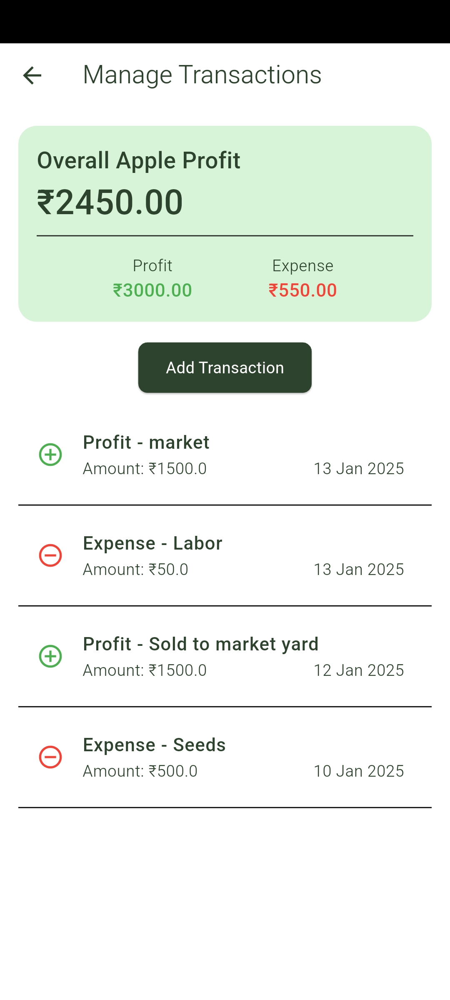
</div>


### 🏆 Top Farmers
A leaderboard showcasing the most active and successful farmers in the community based on engagement and transactions.


<div style="display: flex; justify-content: space-between;">
    
    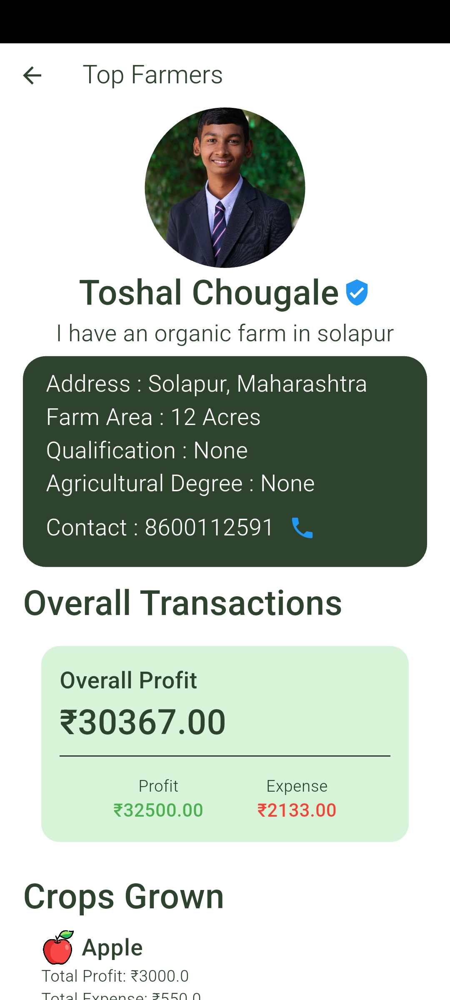
   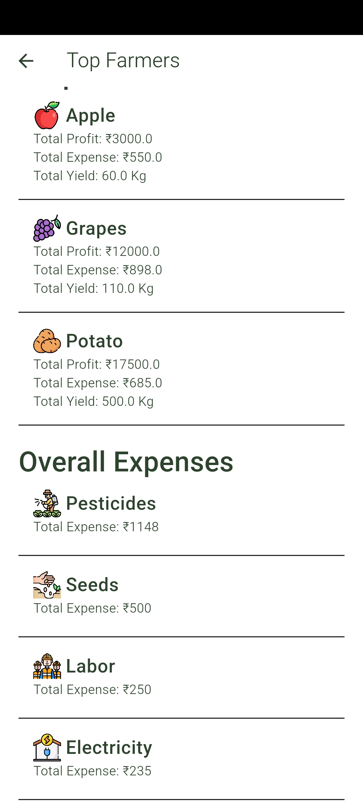
</div>


## Installation
1. Clone the repository:
   ```bash
   git clone https://github.com/Mayank202004/Farmers_Point_V2.git
   ```
2. Navigate to the project directory:
   ```bash
   cd Farmers_Point_V2/farmers_point
   ```
3. Install dependencies:
   ```bash
   flutter pub get
   ```
4. Run the app:
   ```bash
   flutter run
   ```

## Tech Stack
- **Flutter** for the mobile application
- **TensorFlow Lite** for AI-based crop and fruit scanning
- **Supabase** for authentication, database services


## Contributors
- **Mayank Chougale**

---

Made with ❤️ for farmers!
